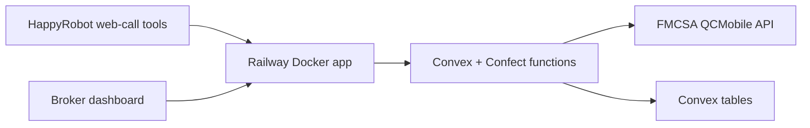

# Acme Logistics HappyRobot Build

## Overview

This build is a broker-owned companion app for a HappyRobot inbound
carrier-sales demo. HappyRobot owns the voice call. The Dockerized TanStack
Start app owns public tool calls, dashboard access, auth, request validation,
and response mapping. Convex/Confect owns carrier cache, seeded loads,
negotiation events, final call ingestion, and dashboard reporting.

## Architecture

- TanStack Start serves `/`, `/health`, and the four HappyRobot server routes.
- Confect defines Convex tables, function specs, typed errors, and function
  implementations from Effect schemas.
- Convex stores `loads`, `fmcsaCache`, `calls`, and `offerEvents`.
- `src/data/loads.json` is the seeded source for Acme demo loads.
- The dashboard reads only from our Convex records, not HappyRobot analytics.



## Public API

All HappyRobot-facing endpoints require `x-api-key`.

- `POST /api/carriers/verify`: normalizes MC text, calls Convex, checks FMCSA
  cache, calls FMCSA on a miss, and returns eligibility.
- `POST /api/loads/search`: seeds missing loads, scores lane/equipment/date
  preferences, and returns the selected load plus alternatives.
- `POST /api/offers/evaluate`: accepts at or below 108% of loadboard rate
  rounded to $25, counters before turn 3, and rejects after turn 3 or
  unrealistic offers.
- `POST /api/calls`: stores HappyRobot extraction/classification output for
  dashboard reporting.
- `GET /health`: Railway deployment health check.

## Security

- HappyRobot uses only the Railway Docker app URL, never direct Convex URLs.
- Public API requests require `HAPPYROBOT_API_KEY`.
- Railway-to-Convex calls include server-only `CONVEX_BACKEND_KEY`.
- FMCSA key is stored only in Convex env.
- Dashboard reads require HTTP Basic auth.
- API and dashboard attempts use a fixed-window in-memory rate limit.
- Responses set clickjacking, MIME sniffing, and referrer hardening headers.
- Broad CORS is not enabled.

## HappyRobot Workflow

Use the web-call trigger, not a purchased phone number.

1. Persona: Maya, inbound carrier sales rep for Acme Logistics.
2. Greet the carrier and collect MC number.
3. Call `verify_carrier`; decline politely when ineligible.
4. Ask lane/equipment preferences; call `search_loads`.
5. Pitch one load with origin, destination, pickup, delivery, equipment, weight,
   commodity, miles, and rate.
6. If the carrier counters, call `evaluate_offer` for up to three turns.
7. On agreement, say: "Transfer was successful and now you can wrap up the
   conversation."
8. After the call, run AI Extract for offer fields, AI Classify for outcome,
   AI Classify or a real-time classifier for sentiment, then webhook to
   `/api/calls`.

## Reproduction

```bash
pnpm install
pnpm confect:codegen
cp .env.example .env.local
pnpm convex:dev
pnpm dev
```

Railway env:

```text
HAPPYROBOT_API_KEY=...
DASHBOARD_BASIC_USER=...
DASHBOARD_BASIC_PASSWORD=...
CONVEX_URL=...
CONVEX_BACKEND_KEY=...
```

Convex env:

```text
FMCSA_WEB_KEY=...
CONVEX_BACKEND_KEY=...
```

Verification:

```bash
pnpm test
pnpm typecheck
pnpm check
pnpm build
docker build -t acme-logistics .
```

## Deployment

Deploy Convex first with `pnpm convex:deploy`, then deploy the Docker app from
GitHub or the Railway CLI. Railway reads `railway.json`, builds the Dockerfile,
injects `PORT`, and checks `/health` before activating a deployment.

## Limitations

- FMCSA availability is external; failures return a clean `502`.
- Transfer is intentionally mocked because the challenge asks for a mock
  transfer message.
- Demo load data is compact; production would add broker TMS integration,
  richer lane matching, and audit exports.
