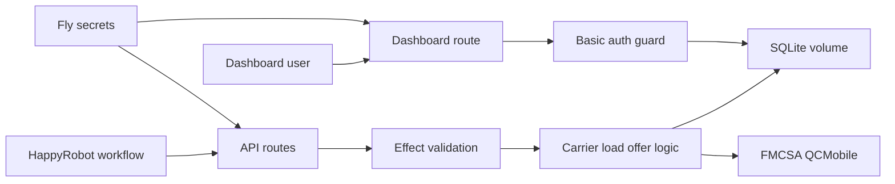

# FDE Threat Model

## Executive summary

The app is a small public internet-facing broker companion service for a
HappyRobot voice workflow. The highest-risk areas are the public HappyRobot API
routes, the dashboard authentication boundary, server-only secret handling, FMCSA
lookup behavior, and SQLite integrity. Current controls include shared API-key
auth, Basic auth for the dashboard, Effect Schema runtime validation, prepared
SQLite statements, fixed-window rate limiting, server-only env configuration,
and Docker/Fly deployment with a persistent volume.

## Scope and assumptions

In scope:

- Runtime app under `src/`, deployment config in `Dockerfile` and `fly.toml`,
  package/dependency metadata, and documentation that affects deployment.

Out of scope:

- Generated registry internals under `src/components/evilcharts/` and
  `src/components/ui/` except where app data crosses into them.
- Local build artifacts, screenshots, SQLite files, and `node_modules`.

Assumptions:

- The app is intended to be exposed over HTTPS on Fly.io.
- HappyRobot is the only expected caller for `/api/*`, using `x-api-key`.
- The dashboard is for a small broker/operator audience using HTTP Basic auth.
- Call records can contain business-sensitive carrier/load negotiation data, but
  not payment data or regulated medical/financial PII.

Open questions that would change ranking:

- Whether the GitHub repo should be public or private for final review.
- Whether production will run more than one Fly machine, which affects the
  strength of in-memory rate limiting.
- Whether a stricter CSP with nonces is required for the production review
  environment.

## System model

### Primary components

- TanStack Start server and React dashboard: `src/routes/index.tsx`.
- Public HappyRobot API server routes:
  `src/routes/api/carriers/verify.ts`, `src/routes/api/loads/search.ts`,
  `src/routes/api/offers/evaluate.ts`, and `src/routes/api/calls.ts`.
- Effect API boundary and domain errors: `src/server/api.ts`.
- Runtime schemas for requests, FMCSA slices, and stored records:
  `src/domain/schemas.ts`.
- SQLite store and migrations: `src/server/database.ts`.
- FMCSA outbound lookup: `src/domain/carriers.ts`.
- Deployment/runtime config: `Dockerfile`, `fly.toml`, `.env.example`.

### Data flows and trust boundaries

- HappyRobot -> public API routes: JSON over HTTPS, authenticated with
  `x-api-key`, rate limited by request IP, decoded with Effect Schema.
- Public API routes -> domain logic: normalized MC numbers, load constraints,
  offer inputs, and final call extraction payloads.
- Carrier verification -> FMCSA: outbound HTTPS lookup with server-only
  `FMCSA_WEB_KEY`; response decoded through a narrow schema.
- API/domain logic -> SQLite: prepared statements store cached carrier checks,
  calls, and offer events.
- Browser operator -> dashboard `/`: HTTPS GET with Basic auth, rate limited,
  response guarded before SSR fallthrough.
- Dashboard -> SQLite: server-only read path aggregates stored call and offer
  records into metrics.

#### Diagram

## Assets and security objectives

| Asset | Why it matters | Security objective (C/I/A) |
| --- | --- | --- |
| `HAPPYROBOT_API_KEY` | Gates public write endpoints | C/I |
| `FMCSA_WEB_KEY` | Third-party API credential | C/A |
| Dashboard credentials | Protects operational metrics | C/I |
| SQLite call and offer records | Business-sensitive negotiation history | C/I/A |
| Load seed data | Drives offer policy and dashboard records | I |
| FMCSA eligibility cache | Determines carrier eligibility | I/A |
| Docker/Fly config | Controls production runtime and persistence | I/A |

## Attacker model

### Capabilities

- Remote internet user can send requests to public app URLs.
- Attacker can guess, replay, or brute-force weak shared API keys/passwords.
- Attacker can send malformed JSON, oversized text fields, and unexpected FMCSA
  or HappyRobot-like payloads.
- Attacker can trigger FMCSA lookups if they have or discover the API key.

### Non-capabilities

- Attacker cannot read Fly secrets or local `.env` files without infrastructure
  compromise.
- Attacker cannot directly access the SQLite volume unless the app or host is
  compromised.
- Attacker cannot control seeded loads unless they can modify the repository or
  deployment artifact.

## Entry points and attack surfaces

| Surface | How reached | Trust boundary | Notes | Evidence |
| --- | --- | --- | --- | --- |
| `/api/carriers/verify` | POST JSON | Internet -> API | API-key auth, rate limiting, schema decode, FMCSA outbound call | `src/routes/api/carriers/verify.ts:4`, `src/server/api.ts:50` |
| `/api/loads/search` | POST JSON | Internet -> API | API-key auth, schema decode, seeded load scoring | `src/routes/api/loads/search.ts:4`, `src/server/api.ts:82` |
| `/api/offers/evaluate` | POST JSON | Internet -> API | API-key auth, schema decode, offer event write | `src/routes/api/offers/evaluate.ts:4`, `src/server/api.ts:108` |
| `/api/calls` | POST JSON | Internet -> API | API-key auth, schema decode, final call write | `src/routes/api/calls.ts:4`, `src/server/api.ts:146` |
| `/` dashboard | GET HTML | Internet -> Dashboard | Basic auth challenge before SSR fallback | `src/routes/index.tsx:44`, `src/server/dashboard.ts:13` |
| FMCSA lookup | Server fetch | App -> FMCSA | Server-only key, JSON decode, error mapping | `src/domain/carriers.ts:49` |
| SQLite database | Local file | App -> persistence | Prepared statements, schema decode on read/write | `src/server/database.ts:57`, `src/server/database.ts:166` |

## Top abuse paths

1. Steal or guess `HAPPYROBOT_API_KEY`, then post fake `/api/calls` data to poison
   dashboard metrics and negotiation audit history.
2. Brute-force weak dashboard Basic auth credentials, then read business-sensitive
   carrier names, MC numbers, lanes, rates, outcomes, and summaries.
3. Send malformed or high-volume API requests to consume app resources or FMCSA
   quota, reducing availability for the live demo.
4. Abuse `/api/carriers/verify` with many MC numbers to turn the app into an
   FMCSA lookup proxy after obtaining the shared API key.
5. Modify deployment env or repository seed data to alter negotiation limits and
   produce broker-unapproved accept/counter decisions.
6. Exploit future dashboard raw HTML rendering if stored call summaries are ever
   inserted through an unsafe DOM sink instead of JSX text rendering.

## Threat model table

| Threat ID | Threat source | Prerequisites | Threat action | Impact | Impacted assets | Existing controls (evidence) | Gaps | Recommended mitigations | Detection ideas | Likelihood | Impact severity | Priority |
| --- | --- | --- | --- | --- | --- | --- | --- | --- | --- | --- | --- | --- |
| TM-001 | Remote attacker | API key is weak, leaked, or reused | Post forged calls/offers or run unauthorized load/offer APIs | Dashboard poisoning and business workflow confusion | API key, SQLite records, metrics | `x-api-key` auth in `src/server/api.ts:208`, schema decode in `src/server/api.ts:54`, rate limit in `src/server/api.ts:210` | Shared static key has no per-tool identity or rotation metadata | Use long random Fly secret, rotate after demos, consider per-tool keys or signed webhook headers | Alert on invalid API key spikes and unusual call volume | Medium | Medium | Medium |
| TM-002 | Remote attacker | Dashboard password is weak or reused | Brute-force Basic auth and view metrics | Exposes carrier/load/rate negotiation data | Dashboard credentials, call records | Basic challenge in `src/server/dashboard.ts:13`, rate limit in `src/server/dashboard.ts:16` | In-memory limiter is per process; Basic auth has no MFA/session audit | Use strong unique password, keep one Fly machine for demo or add edge/durable rate limit | Track 401/429 rates and unusual IPs | Medium | Medium | Medium |
| TM-003 | Remote attacker with API key | Can call carrier verification repeatedly | Drive FMCSA quota/availability pressure | FMCSA checks fail or demo carrier vetting degrades | FMCSA key, app availability | Cache read before FMCSA in `src/server/api.ts:60`, FMCSA errors map to `502` in `src/server/api.ts:179` | Cache has no TTL or quota budgeting | Add cache TTL and operator quota if this becomes production | Count FMCSA calls and non-2xx responses | Low | Medium | Low |
| TM-004 | Remote attacker | Can send malformed JSON or unexpected values | Trigger parser or persistence edge cases | API errors or metric corruption | SQLite records, API availability | Effect Schema request validation in `src/domain/schemas.ts:38`, prepared statements in `src/server/database.ts:175` | No explicit payload size limit in app code | Rely on Fly/proxy limits for demo; add body size guard for production | Monitor 400 response rate and request sizes | Low | Medium | Low |
| TM-005 | Supply-chain attacker | Dependency update resolves to malicious or vulnerable package | Compromise build/runtime artifact | Secrets, records, deployment integrity | Build artifacts, secrets, app code | Lockfile present, manifest versions pinned in `package.json:24` | Registry risk remains for future installs | Keep lockfile committed, review Dependabot/Renovate PRs, run `pnpm audit` before deploy | Dependency advisory scans in CI | Low | High | Medium |
| TM-006 | Future feature developer | Adds rich text rendering or unsafe chart config from stored data | Stored XSS in dashboard | Operator browser compromise | Dashboard session, visible data | Current dashboard renders values through JSX text paths in `src/routes/index.tsx:236` | Generated chart component has `dangerouslySetInnerHTML` for CSS from local config | Keep chart configs developer-controlled; add DOMPurify only if user HTML becomes required | Search for `dangerouslySetInnerHTML` and DOM sinks in CI | Low | Medium | Low |

## Criticality calibration

- Critical: direct pre-auth RCE, committed production secrets, or unauthenticated
  read/write access to all call records.
- High: bypassing dashboard auth, client-bundling server secrets, or persistent
  tampering with negotiation decisions at scale.
- Medium: forged call ingestion with leaked shared API key, brute-forceable Basic
  auth, or dependency drift that can compromise future builds.
- Low: FMCSA quota pressure with a valid API key, noisy malformed request DoS
  mitigated by platform limits, or unsafe rendering risks that require future
  developer changes.

## Focus paths for security review

| Path | Why it matters | Related Threat IDs |
| --- | --- | --- |
| `src/server/api.ts` | Central auth, validation, error, and rate-limit boundary for public API routes | TM-001, TM-003, TM-004 |
| `src/server/dashboard.ts` | Dashboard Basic auth and response-header boundary | TM-002 |
| `src/server/rate-limit.ts` | Public surface throttling control | TM-001, TM-002, TM-003 |
| `src/domain/schemas.ts` | Runtime validation source of truth for untrusted inputs | TM-004 |
| `src/domain/carriers.ts` | FMCSA outbound call and response mapping | TM-003 |
| `src/server/database.ts` | SQLite persistence and record decoding | TM-001, TM-004 |
| `src/routes/index.tsx` | Dashboard rendering of stored records | TM-002, TM-006 |
| `Dockerfile` | Production runtime, non-root user, build reproducibility | TM-005 |
| `fly.toml` | HTTPS and persistent volume deployment posture | TM-002, TM-005 |
| `package.json` | Supply-chain and production command configuration | TM-005 |

## Notes on use

This threat model was produced with explicit assumptions because the request was
to proceed without waiting for clarification. Revisit the priority ratings after
final Fly topology, GitHub visibility, production credentials, and HappyRobot
workflow ownership are confirmed.
