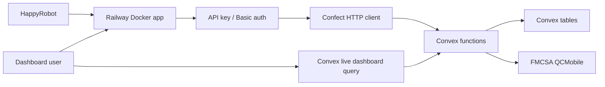

# FDE Threat Model

## Executive Summary

The app is a public, Dockerized broker companion service for a HappyRobot voice
workflow. The highest-risk areas are the HappyRobot API routes, the dashboard
auth boundary, Railway-to-Convex trust boundary, FMCSA outbound lookup, and
stored negotiation records in Convex. Current controls include API-key auth,
Basic auth, a dashboard-only realtime token, server-only secrets, Effect Schema
validation, Confect typed errors, fixed-window rate limiting, hardening headers,
and Docker deployment.

## Scope And Assumptions

In scope:

- Runtime app under `src/`
- Confect/Convex backend under `confect/` and generated `convex/`
- Deployment config in `Dockerfile`, `railway.json`, and `.env.example`
- Security and delivery docs under `docs/`

Assumptions:

- Railway terminates HTTPS for the Docker app.
- HappyRobot is the only intended caller for `/api/*`.
- HappyRobot never calls Convex directly.
- Convex env stores `FMCSA_WEB_KEY`; Railway env stores HappyRobot/dashboard
  secrets, the dashboard realtime token, and the shared `CONVEX_BACKEND_KEY`.
- Dashboard data is business-sensitive, but not payment data or regulated
  medical/financial PII.

## System Model

## Trust Boundaries

| Boundary | Auth | Validation | Notes |
| --- | --- | --- | --- |
| HappyRobot -> Railway API | `x-api-key` | Effect Schema in `src/server/api.ts` | No broad CORS |
| Dashboard browser -> Railway | HTTP Basic auth | Server loader only | Uses no-store headers |
| Dashboard browser -> Convex | `DASHBOARD_REALTIME_TOKEN` | Confect `liveReport` args | One live subscription for dashboard metrics |
| Railway -> Convex | `CONVEX_BACKEND_KEY` arg | Confect specs and typed errors | Convex functions reject missing/wrong key |
| Convex -> FMCSA | `FMCSA_WEB_KEY` | FMCSA response schema | Failures map to clean API errors |
| Convex -> tables | Convex function auth | Table schemas from Effect | App-owned records only |

## Assets

| Asset | Objective |
| --- | --- |
| `HAPPYROBOT_API_KEY` | Prevent forged tool/webhook calls |
| `CONVEX_BACKEND_KEY` | Prevent direct Convex abuse |
| `DASHBOARD_REALTIME_TOKEN` | Gate browser-side dashboard live query |
| `FMCSA_WEB_KEY` | Protect third-party API access |
| Dashboard credentials | Protect operational metrics |
| Convex call/offer records | Preserve dashboard integrity and confidentiality |
| Seeded load data | Preserve pricing and lane policy integrity |

## Abuse Paths

| ID | Abuse Path | Impact | Existing Controls | Priority |
| --- | --- | --- | --- | --- |
| TM-001 | Leaked `HAPPYROBOT_API_KEY` posts forged calls/offers | Dashboard and audit poisoning | API key check, schemas, rate limit | Medium |
| TM-002 | Weak Basic auth password exposes dashboard | Carrier/load/rate data disclosure | Basic challenge, rate limit, no-store headers | Medium |
| TM-003 | Direct Convex caller guesses deployment URL | Backend logic abuse | Required `CONVEX_BACKEND_KEY` in every public Confect function | Medium |
| TM-003A | Dashboard realtime token leaks from an authenticated browser | Operational metric disclosure | Separate dashboard-only token, no backend write capability | Medium |
| TM-004 | High-volume carrier verification burns FMCSA quota | Carrier vetting degradation | Cache, API key, rate limit, clean `502` mapping | Low |
| TM-005 | Malformed JSON or unexpected fields hit public API | Runtime errors or data corruption | Effect Schema decode before Convex call | Low |
| TM-006 | Future dashboard feature renders raw stored text | Stored XSS | Current JSX text rendering; avoid raw HTML sinks | Low |
| TM-007 | Dependency or generated-code drift changes backend contracts | Build/runtime compromise | Lockfile, Confect codegen, tests | Medium |

## Review Focus Paths

- `src/server/api.ts`: public API auth, decode, error mapping
- `src/server/backend.ts`: Railway-to-Convex trust boundary
- `confect/*.spec.ts`: backend public contract and typed errors
- `confect/*.impl.ts`: Convex auth checks, FMCSA calls, writes
- `src/server/dashboard.ts`: Basic auth and dashboard loader
- `confect/dashboard.impl.ts`: realtime dashboard token check and bounded
  report query
- `src/domain/schemas.ts`: request, response, and table schema source
- `Dockerfile` and `railway.json`: production runtime and healthcheck posture

## Residual Risk

The main remaining production hardening item is rate limiting. The current
process-local limiter is enough for the current single-instance deployment, but
a scaled deployment
should move API and dashboard throttling to Railway edge/proxy controls or a
durable store.
